# DeepMirror-WebSites

**Download de sites de alta fidelidade**. Capture experiências complexas (WebGL, Three.js, Rive, SPAs) através da gravação de tráfego de rede em tempo de execução (Runtime Network Recording) para AI Design, possibilitando replicar o estilo para outros tipos de sites.

## ✨ Funcionalidades

### Captura de Alta Fidelidade
- 🎨 **WebGL & Three.js**: Captura texturas, modelos 3D (.glb), shaders e recursos WASM (Draco)
- 🎭 **Animações Rive**: Suporte completo a arquivos .riv e canvas interativos
- 📦 **SPAs modernos**: Next.js, Nuxt, Gatsby, React Router com hydration preservado
- 🖼️ **Lazy Loading inteligente**: Scroll automático + interações simuladas para trigger de recursos
- 🎬 **Recursos dinâmicos**: CDNs externos, fetch() dinâmico, XHR interceptado

### Gravação em Runtime
- 🔍 **Network Recording**: Intercepta TODAS requisições via Playwright (`page.on('response')`)
- 🗺️ **URL Rewriting**: Substituição global de URLs remotas por paths locais (HTML/CSS/JS)
- 🪝 **Fetch Interceptor**: JavaScript injetado para redirecionar fetch/XHR para arquivos locais
- 📂 **Estrutura preservada**: `assets/gl/textures/diffuse.webp` em vez de hash flat

### Processamento Inteligente
- ✂️ **Remoção cirúrgica**: Remove apenas tracking/analytics, preserva frameworks (Next.js, etc)
- 🔐 **Integrity fix**: Remove atributos `integrity`/`crossorigin` que quebram offline
- 🎯 **Basename rewriting**: Substitui URLs relativas em CSS inline (`url("file.svg")` → `url("/assets/path/file.svg")`)
- 🌐 **URL decode**: Nomes de arquivo com `%2C`, `%20` decodificados corretamente

### Interface & Deploy
- 🔄 **Interface real-time**: Logs de progresso via Server-Sent Events (SSE)
- 📥 **Download ZIP**: Exportação automática após processamento
- 🧹 **Auto-cleanup**: Remove arquivos temporários após 30 minutos
- ☁️ **Deploy-ready**: Configurado para Render, Railway, Docker

## 🎯 Use Cases

### AI Design & Style Transfer
Clone sites complexos para análise de design patterns:
- Extrair paletas de cores de sites WebGL
- Capturar animações e timings para replicação
- Analisar estrutura de componentes interativos

### Design System Research
Baixar sites de referência para estudar:
- Arquitetura de animações (GSAP, Framer Motion)
- Sistemas de grid e spacing
- Micro-interações e feedback visual

### Offline Showcase
Manter portfólios de clientes acessíveis:
- Backups de sites que podem sair do ar
- Versões específicas para apresentações
- Demonstrações offline em eventos

## 🚀 Quick Start

### Requisitos
- Python 3.11+
- `uv` (gerenciador de pacotes Python)

### Instalação

```bash
# Clonar repositório
git clone https://github.com/seu-usuario/DeepMirror-WebSites.git
cd DeepMirror-WebSites

bash setup.sh
```

Acesse: `http://localhost:5001`

### Uso via Script

```python
from downloader import WebsiteDownloader

def log_callback(msg):
    print(msg)

url = 'https://example.com'
output_dir = 'downloads/example'

downloader = WebsiteDownloader(url, output_dir, log_callback)
downloader.process()
```

## 📁 Arquitetura

```
DeepMirror-WebSites/
├── website_downloader/       # Core modules
│   ├── browser.py           # Playwright controller (scroll, canvas interactions)
│   ├── network.py           # Network recorder (intercept, save, map URLs)
│   ├── post_process.py      # HTML/CSS processing, rewriting, cleanup
│   └── __init__.py          # Config constants
├── app.py                   # Flask API + SSE
├── downloader.py            # Public API facade
├── templates/
│   └── index.html           # Web interface
├── downloads/               # Temporary downloads (auto-cleanup)
├── CHANGELOG.md             # Detailed change history
├── FUTURE.md                # Known issues & roadmap
├── LOGS.md                  # Known logs of tested websites
└── README.md                # This file
```

### Fluxo de Captura

```mermaid
graph LR
    A[URL] --> B[Playwright Launch]
    B --> C[Page Load + Scroll]
    C --> D[WebGL Canvas Interactions]
    D --> E[Network Idle Wait]
    E --> F[Save Captured Resources]
    F --> G[Process HTML/CSS/JS]
    G --> H[Inject Fetch Interceptor]
    H --> I[Global URL Rewrite]
    I --> J[ZIP Download]
```



## 🔧 Configuração Avançada

### Timeouts e Limites

Editar `website_downloader/__init__.py`:

```python
BROWSER_TIMEOUT = 60000      # 60s para page.goto()
RESOURCE_TIMEOUT = 15        # 15s por recurso
MAX_RESOURCE_SIZE = 100 * 1024 * 1024  # 100MB por arquivo
MAX_SCROLL_ITERATIONS = 20   # Máximo de scrolls
```

### Domínios Ignorados

Adicionar domínios de tracking em `SKIP_DOMAINS`:

```python
SKIP_DOMAINS = [
    'google-analytics.com',
    'googletagmanager.com',
    'facebook.com',
    # ... adicionar mais
]
```

## 📝 Notas Técnicas

### Por que "Runtime Network Recording"?

Diferente de parsers estáticos que tentam adivinhar recursos do HTML/CSS, este projeto:

1. **Executa o site real** via Playwright
2. **Intercepta TODAS requisições** de rede (images, scripts, fetch, XHR, workers)
3. **Salva o que realmente foi carregado** (não o que "deveria" carregar)
4. **Reescreve URLs** em todos arquivos (HTML, CSS, JS, JSON) para apontar para disco

Resultado: Sites complexos com WebGL/Three.js/Rive funcionam offline com alta fidelidade.

### Frameworks Suportados

- **Next.js**: Hydration preservado, rotas estáticas funcionam
- **Nuxt**: SSR assets capturados, `__NUXT__` state mantido
- **Gatsby**: Build estático funciona perfeitamente
- **React Router**: Rotas client-side requerem servidor (limitação conhecida)
- **WebGL/Three.js**: Texturas, modelos, shaders, WASM (Draco) capturados
- **Rive**: Arquivos `.riv` e canvas interativos funcionam

### Limitações Conhecidas

- **Rotas client-side**: SPAs com router precisam de servidor local (não funciona abrindo `index.html` direto)
- **WebSockets**: Não funcionam offline (esperado)
- **Autenticação**: Sites com login não podem ser baixados (sem cookies)
- **Infinite scroll**: Captura até `MAX_SCROLL_ITERATIONS` (padrão: 20)

## 🚀 Deploy em Produção

Veja [DEPLOY.md](DEPLOY.md) para instruções de deploy em:
- Render
- Railway
- Docker
- Heroku

## 📄 Changelog

Veja [CHANGELOG.md](CHANGELOG.md) para histórico detalhado de mudanças.

## 🔮 Roadmap

Veja [FUTURE.md](FUTURE.md) para features planejadas e bugs conhecidos.

## 📄 Licença

Uso pessoal e educacional. Este projeto é uma ferramenta de pesquisa e análise de design.

**Nota ética**: Respeite direitos autorais. Use apenas para:
- Análise de design pessoal
- Backup de seus próprios sites
- Pesquisa educacional
- Sites com permissão explícita

## 🤝 Contribuindo

Contribuições são bem-vindas! Por favor:

1. Fork o projeto
2. Crie uma branch para sua feature (`git checkout -b feature/AmazingFeature`)
3. Commit suas mudanças (`git commit -m 'Add some AmazingFeature'`)
4. Push para a branch (`git push origin feature/AmazingFeature`)
5. Abra um Pull Request

---

**Desenvolvido com ❤️ para AI Design & Style Transfer**

GitHub: [DeepMirror-WebSites](https://github.com/Heitor-Tasso/DeepMirror-WebSites)
