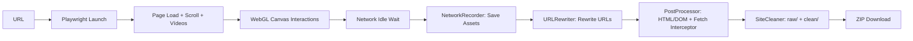

# DeepMirror-WebSites

**Download de sites de alta fidelidade**. Capture experiências complexas (WebGL, Three.js, Rive, SPAs) através da gravação de tráfego de rede em tempo de execução (Runtime Network Recording) para AI Design, possibilitando replicar o estilo para outros tipos de sites.

## ✨ Funcionalidades

### Captura de Alta Fidelidade
- 🎨 **WebGL & Three.js**: Captura texturas, modelos 3D (.glb), shaders e recursos WASM (Draco)
- 🎭 **Animações Rive**: Suporte completo a arquivos .riv e canvas interativos
- 📦 **SPAs modernos**: Next.js, Nuxt, Gatsby, React Router com hydration preservado
- 🖼️ **Lazy Loading inteligente**: Scroll automático + interações simuladas para trigger de recursos
- 🎬 **Recursos dinâmicos**: CDNs externos, fetch() dinâmico, XHR interceptado

### Gravação em Runtime
- 🔍 **Network Recording**: Intercepta TODAS requisições via Playwright (`page.on('response')`)
- 🗺️ **URL Rewriting**: Substituição global de URLs remotas por paths locais (HTML/CSS/JS)
- 🪝 **Fetch Interceptor**: JavaScript injetado para redirecionar fetch/XHR para arquivos locais
- 📂 **Estrutura preservada**: `assets/gl/textures/diffuse.webp` em vez de hash flat

### Processamento Inteligente
- ✂️ **Remoção cirúrgica**: Remove apenas tracking/analytics, preserva frameworks (Next.js, etc)
- 🔐 **Integrity fix**: Remove atributos `integrity`/`crossorigin` que quebram offline
- 🎯 **Basename rewriting**: Substitui URLs relativas em CSS inline (`url("file.svg")` → `url("/assets/path/file.svg")`)
- 🌐 **URL decode**: Nomes de arquivo com `%2C`, `%20` decodificados corretamente
- 🧠 **Baseline inteligente**: Detecta automaticamente se deve usar o HTML estático original ou o DOM hidratado capturado pelo Playwright
- 🎠 **Runtime cleanup**: Remove artefatos de sliders/carrosséis (Swiper, Keen, Splide) que causam duplicação offline

### Limpeza para IA
- 📄 **HTML**: Remove comentários, meta tags de SEO/social e `data-*` vazios
- 🎨 **CSS**: Remove comentários, normaliza indentação, sem minificação
- ⚙️ **JS**: Remove comentários, preserva lógica — pula arquivos já minificados
- 📦 **Saída dupla**: `raw/` (backup fiel) + `clean/` (otimizado para leitura por IA)

### Interface & Deploy
- 🔄 **Interface real-time**: Logs de progresso via Server-Sent Events (SSE)
- 📥 **Download ZIP**: Exportação automática após processamento
- 🧹 **Auto-cleanup**: Remove arquivos temporários após 30 minutos
- ☁️ **Deploy-ready**: Configurado para Render, Railway, Docker

## 🎯 Use Cases

### AI Design & Style Transfer
Clone sites complexos para análise de design patterns:
- Extrair paletas de cores de sites WebGL
- Capturar animações e timings para replicação
- Analisar estrutura de componentes interativos

### Design System Research
Baixar sites de referência para estudar:
- Arquitetura de animações (GSAP, Framer Motion)
- Sistemas de grid e spacing
- Micro-interações e feedback visual

### Offline Showcase
Manter portfólios de clientes acessíveis:
- Backups de sites que podem sair do ar
- Versões específicas para apresentações
- Demonstrações offline em eventos

## 🚀 Quick Start

### Requisitos
- Python 3.11+
- `uv` (gerenciador de pacotes Python)

### Instalação

```bash
# Clonar repositório
git clone https://github.com/seu-usuario/DeepMirror-WebSites.git
cd DeepMirror-WebSites

# Criar configuração local
cp .env.example .env

# Instalar dependências travadas pelo uv.lock
bash setup.sh

# Subir a interface web
uv run python app.py
```

Acesse: `http://localhost:5001`

### Uso via Script

```python
from downloader import WebsiteDownloader

def log_callback(msg):
    print(msg)

url = 'https://example.com'
output_dir = 'downloads/example'

downloader = WebsiteDownloader(url, output_dir, log_callback)
downloader.process()
```

## 📁 Arquitetura

```
DeepMirror-WebSites/
├── app.py                        # Flask app + SSE
├── downloader.py                 # Fachada pública (WebsiteDownloader)
├── website_downloader/
│   ├── __init__.py               # Constantes e configurações centralizadas
│   ├── browser.py                # BrowserController — Playwright, scroll, vídeos
│   ├── network.py                # NetworkRecorder — interceptação e salvamento
│   ├── url_rewrite.py            # URLRewriter — reescrita de URLs pós-download
│   ├── fetch_interceptor.js      # Script injetado para redirecionar fetch/XHR
│   ├── post_process/
│   │   ├── core.py               # PostProcessor — orquestração / entry point
│   │   ├── transformers.py       # Restauração de DOM/HTML original
│   │   ├── processors.py         # Localização de assets e limpeza estrutural
│   │   ├── injectors.py          # Import map, bootstrap runtime, fetch interceptor
│   │   ├── baseline.py           # Seleção do melhor HTML base (SSR vs. DOM)
│   │   └── runtime_cleanup.py    # Remoção de artefatos de sliders e carrosséis
│   └── clean/
│       ├── manager.py            # SiteCleaner — orquestração raw/clean
│       ├── clean_html.py         # Limpeza de HTML para IA
│       ├── clean_css.py          # Limpeza de CSS para IA
│       └── clean_js.py           # Limpeza de JS para IA
├── templates/
│   ├── index.html
│   ├── serve_outside.py
│   └── serve_template.py
├── static/
│   ├── css/style.css
│   └── js/main.js
├── development/                  # Prompts, logs e changelog internos
├── downloads/                    # Sites baixados (gerado em runtime)
├── setup.sh / build.sh / Dockerfile
└── pyproject.toml / uv.lock
```

### Estrutura do `post_process`

- `core.py`: mantém a classe `PostProcessor` e apenas orquestra a pipeline.
- `transformers.py`: concentra matching entre DOM capturado e HTML original, restauração de nós e pruning SSR-safe.
- `processors.py`: concentra reescrita/localização de URLs, assets, scripts, preloads e limpeza de tracking.
- `injectors.py`: concentra import map, fetch interceptor, bootstraps Shopify e materialização de preloads externos.

### Fluxo de Captura



## 🔧 Configuração Avançada

### Timeouts e Limites

Editar `.env`:

```dotenv
DM_BROWSER_TIMEOUT_MS=60000
DM_RESOURCE_TIMEOUT_S=15
DM_MAX_RESOURCE_SIZE_MB=100
DM_MAX_SCROLL_ITERATIONS=20
DM_CLEAN_MODE=full
```

### Domínios Ignorados

Sobrescrever `DM_SKIP_DOMAINS` no `.env`:

```dotenv
DM_SKIP_DOMAINS=google-analytics.com,googletagmanager.com,facebook.com,seu-dominio.com
```

### Dependências e Build

- O projeto usa `pyproject.toml` como fonte única de dependências.
- O lockfile `uv.lock` deve ser versionado para builds reproduzíveis.
- `bash setup.sh` executa `uv sync --frozen` e instala o Chromium do Playwright no ambiente isolado.

## 📝 Notas Técnicas

### Por que "Runtime Network Recording"?

Diferente de parsers estáticos que tentam adivinhar recursos do HTML/CSS, este projeto:

1. **Executa o site real** via Playwright
2. **Intercepta TODAS requisições** de rede (images, scripts, fetch, XHR, workers)
3. **Salva o que realmente foi carregado** (não o que "deveria" carregar)
4. **Reescreve URLs** em todos arquivos (HTML, CSS, JS, JSON) para apontar para disco

Resultado: Sites complexos com WebGL/Three.js/Rive funcionam offline com alta fidelidade.

### Frameworks Suportados

- **Next.js**: Hydration preservado, rotas estáticas funcionam
- **Nuxt**: SSR assets capturados, `__NUXT__` state mantido
- **Gatsby**: Build estático funciona perfeitamente
- **React Router**: Rotas client-side requerem servidor (limitação conhecida)
- **WebGL/Three.js**: Texturas, modelos, shaders, WASM (Draco) capturados
- **Rive**: Arquivos `.riv` e canvas interativos funcionam

### Limitações Conhecidas

- **Rotas client-side**: SPAs com router precisam de servidor local (não funciona abrindo `index.html` direto)
- **WebSockets**: Não funcionam offline (esperado)
- **Autenticação**: Sites com login não podem ser baixados (sem cookies)
- **Infinite scroll**: Captura até `MAX_SCROLL_ITERATIONS` (padrão: 20)

## 🚀 Deploy em Produção

Veja [DEPLOY.md](DEPLOY.md) para instruções de deploy em:
- Render
- Railway
- Docker
- Heroku

## 📄 Changelog

Veja [CHANGELOG.md](development/CHANGELOG.md) para histórico detalhado de mudanças.

## 🔮 Roadmap

Veja [FUTURE.md](FUTURE.md) para features planejadas e bugs conhecidos.

## 📄 Licença

Uso pessoal e educacional. Este projeto é uma ferramenta de pesquisa e análise de design.

**Nota ética**: Respeite direitos autorais. Use apenas para:
- Análise de design pessoal
- Backup de seus próprios sites
- Pesquisa educacional
- Sites com permissão explícita

## 🤝 Contribuindo

Contribuições são bem-vindas! Por favor:

1. Fork o projeto
2. Crie uma branch para sua feature (`git checkout -b feature/AmazingFeature`)
3. Commit suas mudanças (`git commit -m 'Add some AmazingFeature'`)
4. Push para a branch (`git push origin feature/AmazingFeature`)
5. Abra um Pull Request

---

**Desenvolvido com ❤️ para AI Design & Style Transfer**

GitHub: [DeepMirror-WebSites](https://github.com/Heitor-Tasso/DeepMirror-WebSites)
